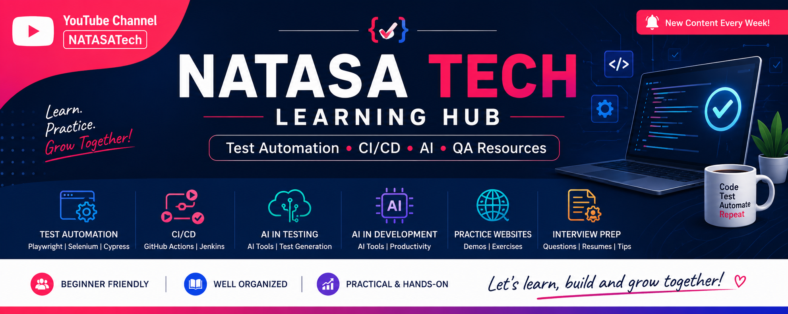

  

# 📚 Natasa Tech Learning Hub

Welcome to the **Natasa Tech Learning Hub** 👋

This repository is a structured collection of **test automation, CI/CD, AI, and QA learning materials**, created to support my YouTube content and help learners understand concepts and practice effectively.

---

## 📌 What You’ll Find Here

* 📊 PPTs and presentations
* 📂 Notes and documents
* 🧪 Sample automation code
* ⚙️ CI/CD examples
* 🤖 AI usage in testing & AI Tools Learning
* 💼 Interview preparation materials
* 🌐 Practice websites

---

## 🧭 How to Use This Repository

Beginner Path

➡️ 03_Testing_Concepts → 01_Test_Automation_Tools → 05_Practice_Websites → 02_CI_CD

📺 From YouTube

➡️ Go to:
📂 09_Videos_References/YouTube_Links.md

🧪 Practice Tip
Start small
Try real scenarios
Write your own scripts
---

## 📂 Repository Structure

* 01_Test_Automation_Tools → Playwright, Selenium, Cypress
* 02_CI_CD → CI/CD concepts and tools
* 03_Testing_Concepts → Manual, API, frameworks design pattern
* 04_AI_in_Testing → AI usage in QA
* 05_AI_in_Development → AI usage in Development
* 06_Practice_Websites → Demo sites & exercises
* 07_Interview_Preparation → Questions & resumes
* 08_Learning_Materials → PPTs & documents
* 09_Videos_References → YouTube mapping
* 010_Resources → Tools & links
* 011_Framework → Framework Types

---

## 🎯 Purpose

This repository is created to:

* Organize learning materials in one place
* Help beginners understand automation tools
* Support hands-on practice
* Provide reference materials for interviews

---

## 📺 YouTube Channel

YouTube # https://www.youtube.com/c/NATASATech

---

## 👩‍💻 Author

**Sangeetha Natarajan**
QA Automation Engineer

---

## ⭐ Connect
Linkedin # https://www.linkedin.com/in/sangeethanata/

---

⭐ Support

If you find this helpful:
👉 ⭐ Star this repository
👉 Share with others
👉 Follow for more content

💡 Tip for Learners

Don’t just read — practice alongside each topic for better understanding 🚀